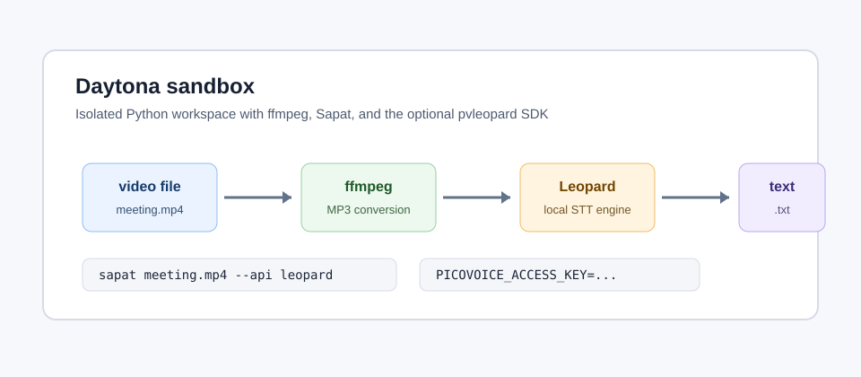

# Run Picovoice Leopard with Sapat in Daytona

## Introduction

Sapat is a small Python command-line tool that turns video files into text. It
already handles the boring parts of a transcription workflow: taking an input
file, converting the audio with `ffmpeg`, calling a selected transcription
backend, and writing a `.txt` file next to the source media.

This guide shows how to run Sapat with Picovoice Leopard inside a Daytona
sandbox. Leopard is useful when you want
[on-device speech-to-text](../definitions/20260524_definition_on_device_speech_to_text.md):
the audio is processed locally in the workspace instead of being uploaded as
the request body of a hosted transcription API. Picovoice still requires an
AccessKey, but the recording stays inside the Daytona environment.

The workflow is intentionally plain. You will create an isolated Daytona
sandbox, install Sapat with the optional Leopard provider, add your Picovoice
AccessKey as an environment variable, and run one transcription command against
a video or audio file.

The main benefit is operational clarity. Hosted speech-to-text APIs are often
the right choice for large-scale production pipelines, but they make local
testing harder because the input audio leaves the development environment and
the request depends on provider-side limits. A local provider lets an engineer
debug the conversion step, transcript file handling, and prompt-independent
audio quality in one place. Daytona adds a clean boundary around that work: the
workspace can be created, rebuilt, and discarded without changing the host
machine.



## TL;DR

- Create a Daytona sandbox so the transcription workflow is reproducible.
- Install Sapat with the optional `pvleopard` dependency.
- Keep `PICOVOICE_ACCESS_KEY` in your shell or `.env`; never commit it.
- Run `sapat <file> --api leopard` to convert audio and write the transcript.
- Use the troubleshooting checklist when `ffmpeg`, Python, or the AccessKey is
  the real blocker.

## Prerequisites

You need:

- A Daytona account and a working `daytona` CLI.
- Python 3.9 or newer. Picovoice Leopard's Python SDK requires Python 3.9+.
- `ffmpeg` in the sandbox.
- A Picovoice AccessKey from the Picovoice Console.
- A short `.mp4`, `.mp3`, `.wav`, or `.flac` file for validation.

The companion Sapat provider implementation for this guide is available in
`nibzard/sapat#44`. If you are testing before that PR is merged, fetch the
branch directly as shown below.

## Step 1: Create a Daytona sandbox

Create a new Daytona sandbox and open a shell in it. The exact command depends
on how you use Daytona, but the CLI supports creating a sandbox directly:

```bash
daytona create
```

Once the sandbox is ready, open its terminal. A clean sandbox keeps the
transcription stack separate from your laptop and makes it easy to repeat the
steps later.

Install system packages used by Sapat:

```bash
sudo apt-get update
sudo apt-get install -y ffmpeg git python3 python3-venv
```

Confirm the tools are present:

```bash
python3 --version
ffmpeg -version | head -n 1
git --version
```

If Python is older than 3.9, create the sandbox from a newer Python image or
install a newer interpreter before continuing.

## Step 2: Clone Sapat and install the Leopard extra

Clone Sapat:

```bash
git clone https://github.com/nibzard/sapat.git
cd sapat
```

If the Picovoice provider PR has not been merged yet, switch to the companion
branch:

```bash
git fetch https://github.com/kpoxo6op/sapat.git \
  codex/leopard-transcription-provider
git checkout FETCH_HEAD
```

Create and activate a virtual environment:

```bash
python3 -m venv .venv
. .venv/bin/activate
python -m pip install --upgrade pip
```

Install Sapat with Leopard support:

```bash
pip install -e ".[leopard]"
```

This installs the normal Sapat dependencies plus `pvleopard`, the official
Picovoice Leopard Python SDK. The provider is lazy-loaded, so the rest of Sapat
can still run without `pvleopard` when you choose `--api openai`, `--api groq`,
or `--api azure`.

Check that the command sees the new backend:

```bash
sapat --help
```

The API option should include `leopard`:

```text
--api [openai|groq|azure|leopard]
```

## Step 3: Configure Picovoice Leopard

Set your Picovoice AccessKey in the shell:

```bash
export PICOVOICE_ACCESS_KEY="paste-your-access-key-here"
```

For repeat runs inside the same repo, you can also create a local `.env` file.
Do not commit this file.

```bash
cat > .env <<'EOF'
PICOVOICE_ACCESS_KEY=paste-your-access-key-here
PICOVOICE_LEOPARD_ENABLE_PUNCTUATION=true
PICOVOICE_LEOPARD_ENABLE_DIARIZATION=false
EOF
```

Optional settings:

```bash
export PICOVOICE_LEOPARD_MODEL_PATH="/absolute/path/to/custom-model.pv"
export PICOVOICE_LEOPARD_DEVICE="best"
export PICOVOICE_LEOPARD_ENABLE_PUNCTUATION="true"
export PICOVOICE_LEOPARD_ENABLE_DIARIZATION="false"
```

Use `PICOVOICE_LEOPARD_MODEL_PATH` when you have a custom `.pv` model from
Picovoice Console. Use `PICOVOICE_LEOPARD_DEVICE=best` when your sandbox or
workstation has more than one possible execution device and you want the SDK to
select the best available target.

Leopard supports several languages through model files. If your recording is
not in English, download or create the correct model in Picovoice Console and
point `PICOVOICE_LEOPARD_MODEL_PATH` at that `.pv` file. Keeping the model path
explicit is also useful in a team setting because every developer can see which
model was used for a transcript.

## Step 4: Add a media file

Copy a short test recording into the sandbox. For example:

```bash
mkdir -p samples
cp ~/Downloads/standup-recording.mp4 samples/standup-recording.mp4
```

If you only want to verify that the conversion path works, generate a tiny MP3
file with `ffmpeg`:

```bash
ffmpeg -f lavfi -i sine=frequency=880:duration=2 \
  -ar 44100 -ac 1 samples/tone.mp3
```

The tone file will not produce a useful transcript, but it can confirm that
`ffmpeg`, paths, and the Leopard provider are wired correctly. For a real
transcript, use a file with spoken audio.

## Step 5: Run Sapat with Leopard

Run Sapat against a video file:

```bash
sapat samples/standup-recording.mp4 --api leopard --quality M
```

Sapat will:

1. Convert `samples/standup-recording.mp4` to
   `samples/standup-recording.mp3`.
2. Initialize Picovoice Leopard with your AccessKey and optional settings.
3. Process the MP3 locally.
4. Write `samples/standup-recording.txt`.
5. Remove the temporary MP3 file.

Review the transcript:

```bash
sed -n '1,120p' samples/standup-recording.txt
```

For directories, Sapat processes each `.mp4` file:

```bash
sapat samples --api leopard --quality M
```

That is useful when you have a folder of meeting recordings and want one text
file per video.

For longer recordings, start with one short sample before batch processing the
whole directory. That confirms the AccessKey, model, and language settings
before you spend time on every file. It also gives you a quick quality check:
if the transcript misses names or product terms, create a custom Leopard model
or choose a clearer audio source before running the full set.

## When to use this workflow

Use the Leopard backend when privacy, offline behavior, or repeatable local
testing matters more than using a hosted transcription endpoint. Examples
include internal engineering standups, customer-call excerpts that cannot leave
your controlled workspace, and regression fixtures where a test should not
depend on a remote API being available.

Use a hosted provider when you need a managed service, centralized billing,
very large batch throughput, or an API feature that Leopard does not provide
for your use case. Sapat keeps those choices behind the same `--api` flag, so
teams can use Leopard for local validation and switch to OpenAI, Groq, or Azure
for another environment without changing the rest of the workflow.

## Step 6: Validate and capture evidence

Before sharing the workflow with a teammate, capture a short validation log:

```bash
python -m unittest discover -s tests -v
sapat --help
ls -lh samples/*.txt
```

For a content or code contribution, include:

- The Sapat provider PR link.
- The exact Sapat command used.
- The Python version.
- Whether the input was a real speech sample or a generated smoke-test file.
- Confirmation that no `.env` file or AccessKey was committed.

## Common Issues and Troubleshooting

**Problem:** `RuntimeError: Picovoice Leopard support requires pvleopard.`

**Solution:** Install the optional dependency in the active virtual environment:

```bash
pip install -e ".[leopard]"
```

**Problem:** `PICOVOICE_ACCESS_KEY is required for --api leopard.`

**Solution:** Export the key in the terminal or add it to an uncommitted `.env`
file:

```bash
export PICOVOICE_ACCESS_KEY="paste-your-access-key-here"
```

**Problem:** `ffmpeg` is missing.

**Solution:** Install it in the sandbox:

```bash
sudo apt-get update
sudo apt-get install -y ffmpeg
```

**Problem:** The transcript is empty.

**Solution:** Confirm that the sample contains spoken audio. A generated tone
file is useful for smoke testing, but it will not produce meaningful words.
Also check whether the selected Leopard model matches the language of the
recording.

**Problem:** The custom model path fails.

**Solution:** Use an absolute path for `PICOVOICE_LEOPARD_MODEL_PATH` and make
sure the `.pv` file is available inside the Daytona sandbox, not just on your
local machine.

## Conclusion

Sapat plus Picovoice Leopard gives you a small, repeatable transcription
workflow that keeps audio processing local to the Daytona sandbox. The command
surface stays the same as the hosted providers: install the backend, set the
environment variable, and choose `--api leopard`.

This pattern works well for internal meetings, private demos, and test fixtures
where uploading recordings to a hosted transcription endpoint is unnecessary.
Because the setup lives in an isolated sandbox, you can rebuild it, hand it to a
teammate, or attach it to a pull request without depending on whatever happens
to be installed on your laptop.

## References

- [Sapat repository](https://github.com/nibzard/sapat)
- [Companion Sapat Picovoice provider PR](https://github.com/nibzard/sapat/pull/44)
- [Picovoice Leopard Python Quick Start](https://picovoice.ai/docs/quick-start/leopard-python/)
- [Picovoice Leopard Python API](https://picovoice.ai/docs/api/leopard-python/)
- [Daytona Getting Started](https://www.daytona.io/docs/getting-started)
